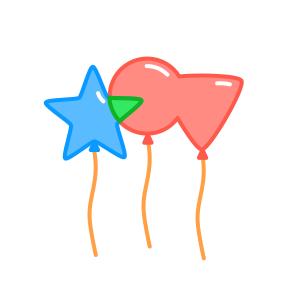
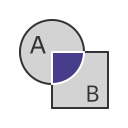

# iShape-js

<p align="center">
  
</p>
2D geometry library for poly-bool operations such as union, intersection, difference and xor.

## [Demo](https://ishape-rust.github.io/iShape-js/overlay/stars_demo.html)
Try out iShape with an interactive demo. The demo covers operations like union, intersection, difference and exclusion

- [Stars Rotation](https://ishape-rust.github.io/iShape-js/overlay/stars_demo.html)
- [Shapes Editor](https://ishape-rust.github.io/iShape-js/overlay/shapes_editor.html)


## Features

- **Operations**: union, intersection, difference, and exclusion.
- **Polygons**: with holes, self-intersections, and multiple paths.
- **Simplification**: removes degenerate vertices and merges collinear edges.
- **Fill Rules**: even-odd and non-zero.

## Getting Started


### Direct include

#### Download Library Files:

- *i_shape.js*
- *i_shape_bg.wasm*

You can find it at: [pkg](https://github.com/iShape-Rust/iShape-js/tree/main/pkg)
  
#### Place Files:
Place these files in a directory that your HTML file can access; in this example, the directory is named *./ishape*


### NPM

#### Installation
You can install the iShape library from NPM:

```bash
npm install i_shape
```

The NPM package is available [here](https://www.npmjs.com/package/i_shape_js)


#### Import and Usage

After installing the NPM package, you can import it in your JavaScript or TypeScript file as follows:

```javascript
import init, { Overlay, OverlayGraph, OverlayRule, ShapeType, FillRule } from './ishape/i_shape.js';

// Your code here

```


### Example

Here is a simple HTML example that demonstrates how to use the iShape library for geometric union and xor operations.
```html
<!DOCTYPE html>
<html lang="en">
<head>
    <meta charset="UTF-8">
    <meta name="viewport" content="width=device-width, initial-scale=1.0">
    <title>iShape</title>
    <style>
        #result {
            background-color: #f5f5f5;
            border: 1px solid #ccc;
            padding: 10px;
            white-space: pre-wrap;
            font-family: monospace;
        }
    </style>
    <script type="module">
        // Import the necessary modules from the iShape library
        // Adjust your path here!!!
        import init, { Overlay, OverlayGraph, OverlayRule, ShapeType, FillRule} from './ishape/i_shape.js';

        // Initialize the iShape library
        init();

        document.getElementById('union').addEventListener('click', () => {

            // create a main polygon, can be multiple paths
            const subj = {
                paths: [
                    {
                        points: [[200, 300], [200, 100], [400, 100], [400, 300]]
                    }
                ]
            }

            // create a clipping polygon, can be multiple paths
            const clip = {
                paths: [
                    {
                        points: [[300, 400], [300, 200], [500, 200], [500, 400]]
                    }
                ]
            }

            // Initialize the Overlay object to handle geometric operations
            const overlay = new Overlay();

            // Add the main polygon to the overlay
            overlay.add_shape(subj, ShapeType.Subject);

            // Add the clipping polygon to the overlay
            overlay.add_shape(clip, ShapeType.Clip);

            // Build the graph for the geometry, using the even-odd rule
            const graph = overlay.build_graph(FillRule.EvenOdd);

            // Apply the union operation on the shapes and extract the result
            const union = graph.extract_shapes(OverlayRule.Union);

            // Apply the xor operation on the shapes and extract the result
            const xor = graph.extract_shapes(OverlayRule.Xor);

            // Apply others operations if necessary

            const resultText = JSON.stringify(result, null, 2);
            document.getElementById('result').innerText = `Result:\n${union}`;
        });
    </script>
</head>
<body>
    <button id="union">Union</button>
    <pre id="result"></pre>
</body>
</html>
```

#### Explanation:

Import classes and initialize the WebAssembly module using init().
Use the imported classes to perform geometric operations.

# Overlay Rules

## Union, A or B


## Intersection, A and B


## Difference, B - A


## Exclusion, A xor B

