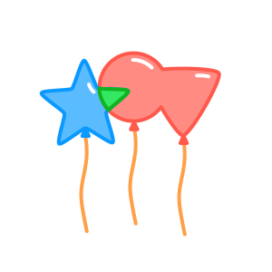
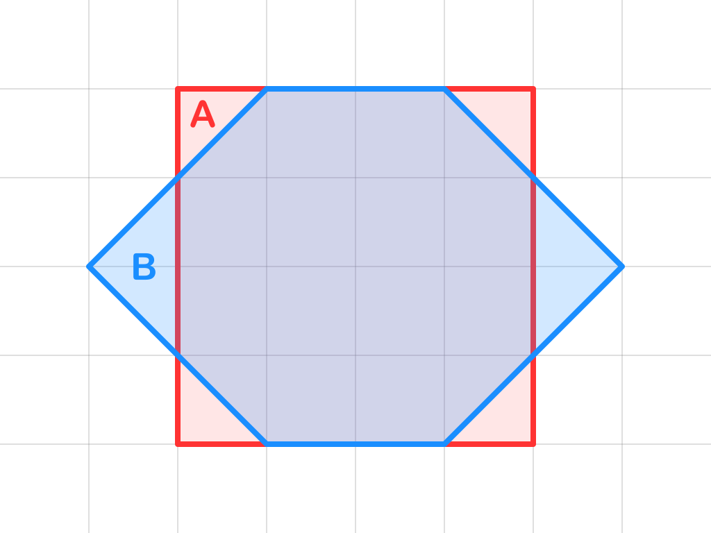
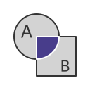
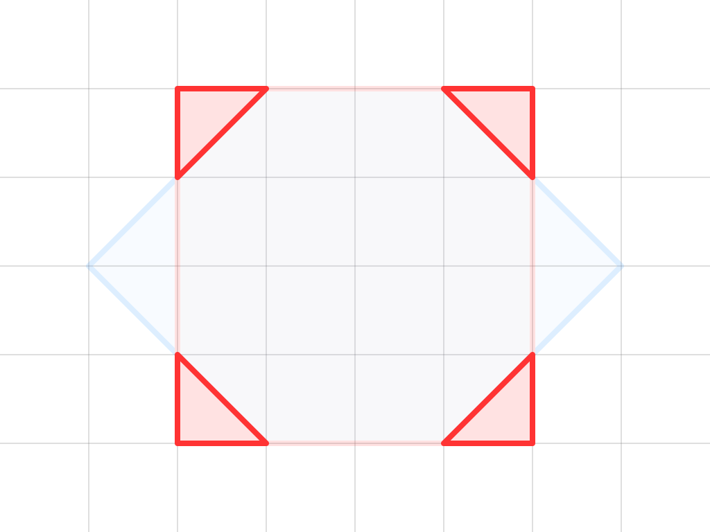
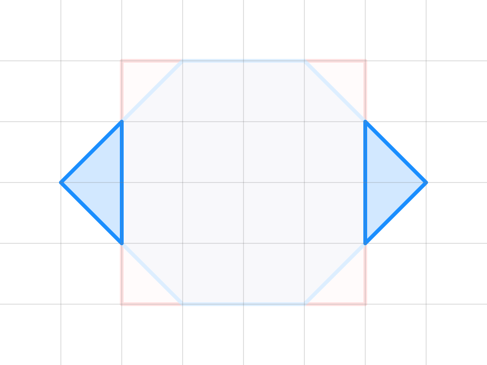
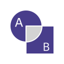

# iShape-js

<p align="center">
  
</p>
A fast 2D geometry library in WebAssembly for JavaScript and TypeScript. Supports Boolean operations on polygons and Bézier curves, buffering, and triangulation.

## [Demo](https://ishape-rust.github.io/iShape-js/overlay/stars_demo.html)
Try out iShape with an interactive demo.

- [Stars Rotation](https://ishape-rust.github.io/iShape-js/overlay/stars_demo.html)
- [Shapes Editor](https://ishape-rust.github.io/iShape-js/overlay/shapes_editor.html)
- [Path Offset](https://ishape-rust.github.io/iShape-js/overlay/stroke.html)
- [Polygon Offset](https://ishape-rust.github.io/iShape-js/overlay/outline.html)
- [Triangulation](https://ishape-rust.github.io/iShape-js/triangle/triangulation.html)
- [iCurve Boolean Playground](https://ishape-rust.github.io/iShape-js/curve/boolean_playground.html)
- [iCurve TypeCurve](https://ishape-rust.github.io/iShape-js/curve/type_curve.html)

## Features

- **Boolean Operations**: union, intersection, difference, and exclusion.
- **Curves**: Boolean operations on lines, quadratic and cubic Bézier curves, and elliptic arcs.
- **Polygons**: with holes, self-intersections, and multiple paths.
- **Simplification**: removes degenerate vertices and merges collinear edges.
- **Fill Rules**: even-odd, non-zero, positive and negative.

## Getting Started


### Direct include

#### Download Library Files:

- *ishape_wasm.js*
- *ishape_bg_wasm.wasm*

You can find it at: [pkg](pkg)
  
#### Place Files:
Place these files in a directory that your HTML file can access; in this example, the directory is named *./ishape*


### NPM

#### Installation
You can install the iShape library from NPM:

```bash
npm install ishape_wasm
```

The NPM package is available [here](https://www.npmjs.com/package/ishape_wasm)


#### Import and Usage

After installing the NPM package, you can import it in your JavaScript or TypeScript file as follows:

```javascript
import init, { Overlay, OverlayRule, FillRule } from './ishape/ishape_wasm.js';

// Your code here

```


### Example
Here is a simple HTML example that demonstrates how to use the iShape library for union operation.
Full example is available [here](https://github.com/iShape-Rust/iShape-js/tree/main/examples/html)
```html
<!DOCTYPE html>
<html lang="en">
<head>
    <meta charset="UTF-8">
    <meta name="viewport" content="width=device-width, initial-scale=1.0">
    <title>iShape</title>
    <style>
        #result {
            background-color: #f5f5f5;
            border: 1px solid #ccc;
            padding: 10px;
            white-space: pre-wrap;
            font-family: monospace;
        }
        textarea {
            width: 100%;
            height: 150px;
            padding: 10px;
            font-family: monospace;
            margin-bottom: 10px;
        }
    </style>
    <script type="module">
        import init, { Overlay, OverlayRule, FillRule} from './ishape/ishape_wasm.js';

        init();

        document.getElementById('union').addEventListener('click', () => {
            const subjInput = document.getElementById('subjInput').value;
            const clipInput = document.getElementById('clipInput').value;

            const subj = JSON.parse(subjInput);
            const clip = JSON.parse(clipInput);

            const overlay = Overlay.new_with_subj_and_clip(subj, clip);

            // apply union operation
            const union = overlay.overlay(OverlayRule.Union, FillRule.EvenOdd);

            // add more operations if required
            // ...

            const resultText = JSON.stringify(union, null, 2);
            document.getElementById('result').innerText = `Result:\n${resultText}`;
        });
    </script>
</head>
<body>
    <textarea id="subjInput" placeholder='Enter "subj" polygon here...'>[[[200, 300], [200, 100], [400, 100], [400, 300]]]</textarea>
    <textarea id="clipInput" placeholder='Enter "clip" polygon here...'>[[[300, 400], [300, 200], [500, 200], [500, 400]]]</textarea>
    <button id="union">Union</button>
    <pre id="result"></pre>
</body>
</html>
```

#### Explanation:

Import classes and initialize the WebAssembly module using init().
Use the imported classes to perform geometric operations.

## Curve Boolean Operations

`CurveBuilder` uses the familiar Canvas-style path methods. Every contour must
be closed before calling `build()`. The returned `CurveGeometry` is reusable:
it can be passed directly into another Boolean operation without converting it
to JavaScript data first.

```javascript
import init, {
    CurveBuilder,
    CurveOverlay,
    OverlayRule,
    FillRule,
} from 'ishape_wasm';

await init();

const subjectBuilder = new CurveBuilder();
subjectBuilder.moveTo(0, 0);
subjectBuilder.bezierCurveTo(25, -30, 75, -30, 100, 0);
subjectBuilder.lineTo(100, 80);
subjectBuilder.lineTo(0, 80);
subjectBuilder.closeContour();
const subject = subjectBuilder.build();

const clipBuilder = new CurveBuilder();
clipBuilder.moveTo(40, -10);
clipBuilder.lineTo(120, -10);
clipBuilder.lineTo(120, 50);
clipBuilder.lineTo(40, 50);
clipBuilder.closeContour();
const clip = clipBuilder.build();

const operation = new CurveOverlay(subject, clip);
const result = operation.overlay(OverlayRule.Intersect, FillRule.NonZero);

// Ordinary typed JavaScript data for rendering or serialization.
console.log(result.toData());
```

Use `quadraticCurveTo()` for quadratic Bézier segments,
`ellipticArcTo()` for an arc in the active contour, or `addEllipse()` to append
a complete ellipse as a new closed contour. Advanced callers can use
`CurveOverlay.withScale()`, `setApproximation()`, and `conversionReport()` to
control and inspect the discrete precision model. Approximation settings are
optional, so callers only specify what they need:

```javascript
operation.setApproximation({ minChordLength: 0.001 });
```

To resolve self-intersections without a clip, use
`CurveOverlay.fromSubject(geometry).resolveSubject(fillRule)`.

# Overlay Rules
| A,B | A ∪ B | A ∩ B | A - B | B - A | A ⊕ B |
|---------|---------------|----------------------|----------------|--------------------|----------------|
|  |  |  |  |  |  |
