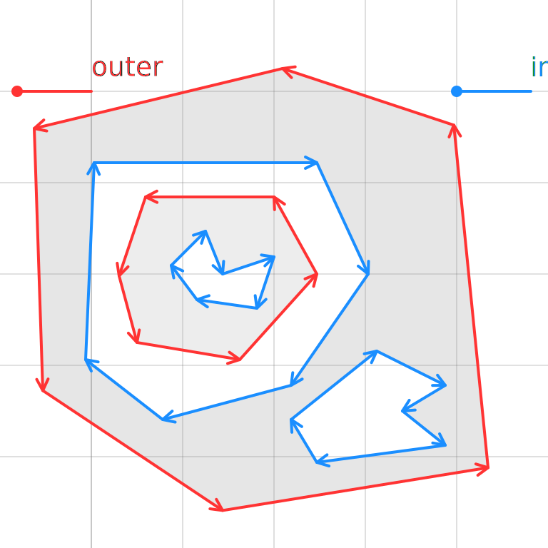

# Contours
## Outer and Inner

In the context of the [Overlay Graph](../overlay_graph/overlay_graph.md), contours are used to represent the boundaries of geometric objects. These contours are classified into two types: **outer** contours and **inner** contours.

### Outer Contour:

 - An outer contour is a sequence of points ordered in a **counterclockwise** direction.
 - The outer contour defines the external boundary of a shape, enclosing the exterior space.

### Inner Contour (Hole or Cave):
 - An inner contour is a sequence of points ordered in a **clockwise** direction.
 - Inner contours represent enclosed areas within an outer contour, often referred to as "holes" or "caves."

_Both **outer** and **inner** contours must be simple, meaning they must not self-intersect and must not share edges with other contours._

