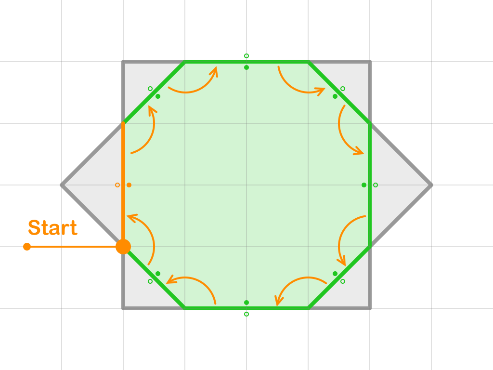
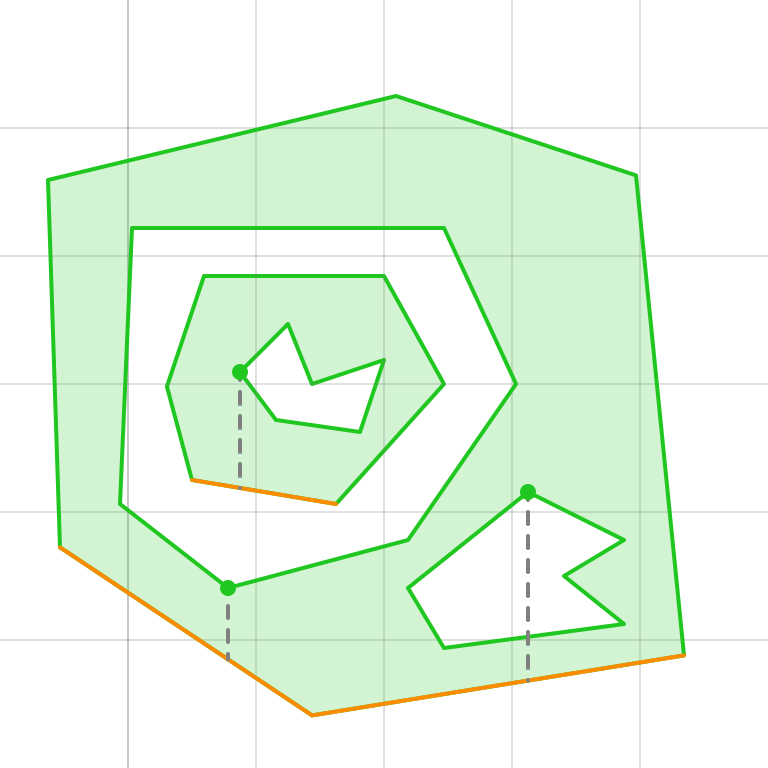

# Extract Shapes

## Build Contour

Once we apply boolean filter to [Overlay Graph](../overlay_graph/overlay_graph.md), we can begin extract contours. The algorithm starts by selecting the leftmost node and proceeds by choosing the topmost segment connected to that node. The process continues by traversing to the next node along the selected segment.

At each node, the algorithm selects the next segment by rotating around the current node to find the next suitable segment, ensuring the traversal stays within the boundary of the shape.

To prevent segments from being visited twice, each segment is marked as visited upon traversal.

This process continues until the contour is complete, forming either an outer or inner contour.

## Define Contour

To define a contour, the algorithm begins by identifying the leftmost and topmost segment in the contour. The classification of the contour is determined as follows:

- If the left-top side of the segment is classified as the **outer** side, then the contour is an **outer** contour.
- If the left-top side of the segment is classified as the **inner** side, then the contour is an **inner** contour.

This method ensures each contour is correctly classified based on its orientation in 2D space.

## Define Shape

A shape is defined as a group of contours, where the first contour is always an **outer** contour, and the subsequent contours (if any) are **inner** contours.

## Matching Contours

To match **inner** contours to their corresponding **outer** contour, a line is drawn from any point on the **inner** contour. The first segment encountered from an **outer** contour beneath this point belongs to the **outer** contour that contains the **inner** contour. This **outer** contour serves as the container for the **inner** contour.
## Define Segment under Point

## Segment under Point

To determine whether a segment **AB** is below a point **P**, one may be tempted to compute the value of ym at the point of intersection **M**, where a vertical line is dropped from **P** onto **AB** (i.e., xp = xm):

$$
y_{m} = \frac{y_{a} - y_{b}}{x_{a} - x_{b}}\cdot(x_{m} - x_{a}) + y_{a}
$$

However, this approach can introduce precision issues due to the division involved.

A more reliable method involves using the order of traversal around the vertices of the triangle **APB**. If segment **AB** is below point **P**, the vertices **A**, **P**, and **B** will appear in a clockwise order.

This method uses the cross product of vectors **PA** and **PB**:

$$
a \times b = a_x b_y - a_y b_x
$$

Since this method avoids division, it eliminates precision issues, making it stable for determining whether a segment is below a point.

## Selecting the Closest Segment under Point

When multiple segments are positioned below point **P**, we need to determine which segment is the closest to **P**. This scenario can be divided into three distinct cases based on the configuration of the segments relative to **P**.

### Left Case

When both segments share a common left vertex **A**, we check the positions of their right endpoints. If the vertices **B0**, **B1**, and **A** form a clockwise pattern, then **AB0** is closer to **P** than **AB1**.

### Right Case

When both segments share a common right vertex **B**, we check the positions of their left endpoints. If the vertices **A0**, **A1**, and **B** form a clockwise pattern, then **A0B** is closer to **P** than **A1B**.

### Middle Case

In this case, one of the vertices (e.g., **A1** or **B0**) lies inside the opposite segment. We use the point-segment comparison method to determine which of the segments is closer to **P**.