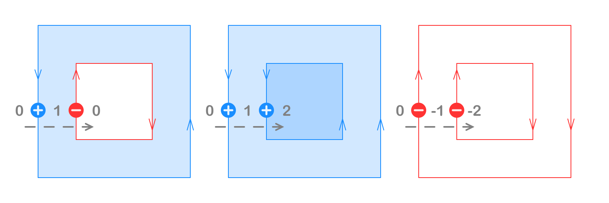

# Filling Rules

## Even-Odd

## Non-Zero

## Positive

## Negative

## Filling Rules:

- **Even-Odd**: Only odd numbered sub-regions are filled
- **Non-Zero**: Only non-zero sub-regions are filled
- **Positive**: Only positive sub-regions are filled
- **Negative**: Only negative sub-regions are filled