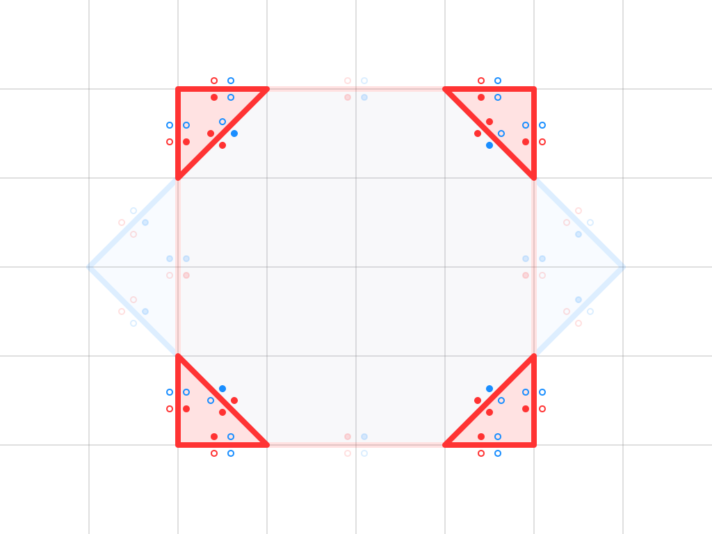

# Overlay Graph

An Overlay Graph is a data structure representing the intersections and overlays of two geometric objects (**A** and **B**) defined by closed contours in 2D space.

The graph is constructed by dividing all the segments of the object contours into non-intersecting parts, where segments can only touch at their endpoints.
Each segment in the graph contains the following properties:

- For each side of the segment, it stores information about its membership to object **A** and object **B**
- Segments do not intersect each other, but they may touch at their endpoints.

for more Overlay Graph examples see [Shape Editor](../shapes_editor.md)

## Filter Segments

### Difference, C = A - B
The resulting segments of C must not be inside body B and must belong to body A on one side.  
The side associated solely with body A will represent the inner part of the resulting shape.

### Difference, C = B - A
The resulting segments of C must not be inside body A and must belong to body B on one side.  
The side associated solely with body B will represent the inner part of the resulting shape.

### Union, C = A or B

The resulting segments of C must belong to either body A or body B, or to both. The opposite side of each segment must not belong to anybody.  
The side associated with one of the bodies will represent the inner part of the resulting shape.

### Intersection, C = A and B

The resulting segments of C must belong to both bodies A and B. The opposite side of each segment must not belong to both bodies simultaneously.  
The side associated with both bodies A and B will represent the inner part of the resulting shape.

### Exclusion, C = A xor B

The resulting segments of C must belong to either body A or body B, but not to both simultaneously. The opposite side of each segment must either belong to both bodies or to neither.    
The side associated with one of the bodies (A or B) will represent the inner part of the resulting shape.
