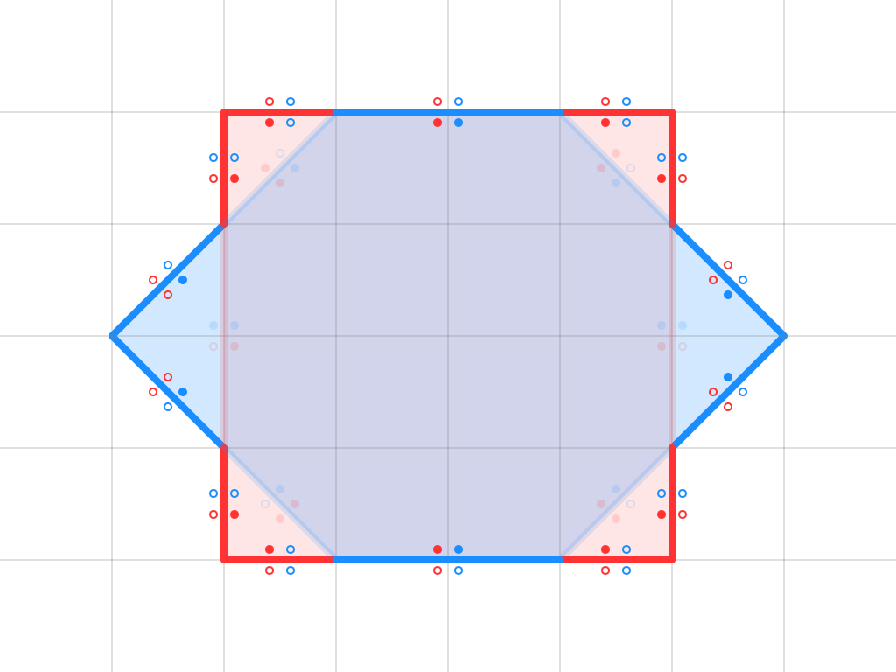

# Overlay Graph

An Overlay Graph is a data structure representing the intersections and overlays of two geometric objects (**A** and **B**) defined by closed contours in 2D space.

The graph is constructed by dividing all the segments of the object contours into non-intersecting parts, where segments can only touch at their endpoints.
Each segment in the graph contains the following properties:

- For each side of the segment, it stores information about its membership to object **A** and object **B**
- Segments do not intersect each other, but they may touch at their endpoints.

for more Overlay Graph examples see [Shape Editor](../shapes_editor.md)

## Filter Segments

### Difference A - B

### Difference B - A

### Union A or B

### Intersection A and B

### Exclusion A xor B

