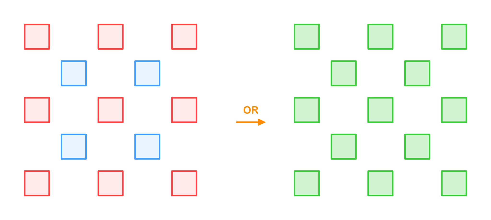

# Performance Comparison

Benchmark project is [here](https://github.com/iShape-Rust/iOverlayPerformance).

All tests were run on a machine with the following specifications:
**3 GHz 6-Core Intel Core i5, 40GB 2667 MHz DDR4**

## Solvers:

- **Rust-iOverlay** v1.5.2
- **Swift-iOverlay**  v1.13.0
- **Clipper2**  v1.4.0

## Checkerboard Test

| Polygons | Swift-iOverlay | Rust-iOverlay (MT off)  | Rust-iOverlay (MT on) | Clipper2    |
|----------|----------------|-------------------------|-----------------------|-------------|
| 5        | 0.000014       | 0.000006                | 0.000007              | 0.000007    |
| 25       | 0.000100       | 0.000038                | 0.000039              | 0.000038    |
| 113      | 0.000589       | 0.000236                | 0.000245              | 0.000208    |
| 481      | 0.004105       | 0.001110                | 0.001167              | 0.001017    |
| 1985     | 0.012643       | 0.005865                | 0.006006              | 0.005182    |
| 8065     | 0.055664       | 0.027997                | 0.026048              | 0.024013    |
| 32513    | 0.234840       | 0.127578                | 0.112609              | 0.154054    |
| 130561   | 0.993920       | 0.571545                | 0.500450              | 1.067439    |
| 523265   | 4.410302       | 2.575630                | 2.217678              | 8.346041    |
| 2095105  | 18.451646      | 11.053004               | 9.038339              | 73.312335   |
| 8384513  | 78.719305      | 46.372958               | 37.829627             | 644.337867  |

## Not Overlap Test

| Polygons | Swift-iOverlay | Rust-iOverlay (MT off) | Rust-iOverlay (MT on) | Clipper2   |
|----------|----------------|------------------------|-----------------------|------------|
| 5        | 0.000009       | 0.000003               | 0.000003              | 0.000005   |
| 25       | 0.000041       | 0.000016               | 0.000016              | 0.000021   |
| 113      | 0.000204       | 0.000073               | 0.000073              | 0.000097   |
| 481      | 0.001052       | 0.000363               | 0.000366              | 0.000457   |
| 1985     | 0.004978       | 0.002116               | 0.002127              | 0.002114   |
| 8065     | 0.021336       | 0.011082               | 0.011077              | 0.010783   |
| 32513    | 0.089523       | 0.050298               | 0.046999              | 0.056281   |
| 130561   | 0.375594       | 0.216340               | 0.198341              | 0.369146   |
| 523265   | 1.663087       | 0.973432               | 0.887804              | 2.695334   |
| 2095105  | 6.947932       | 4.213161               | 3.778962              | 20.665812  |
| 8384513  | 28.777569      | 18.019932              | 15.963110             | 167.966801 |