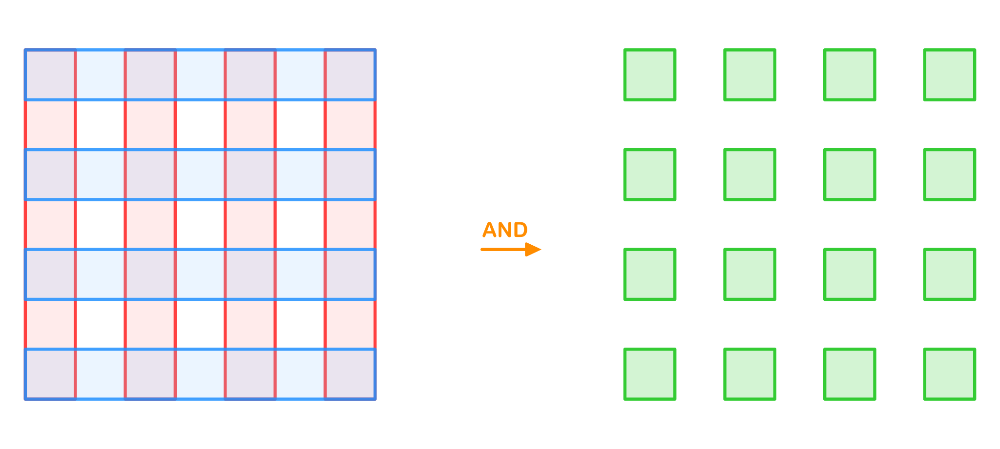

# Performance Comparison

Benchmark project is [here](https://github.com/iShape-Rust/iOverlayPerformance).

All tests were run on a machine with the following specifications:  
**3 GHz 6-Core Intel Core i5, 40GB 2667 MHz DDR4**  

All results are presented in seconds.

## Solvers:

- **iOverlay(Rust)** v1.5.2 (multithreading on/off)
- **iOverlay(Swift)**  v1.13.0
- **Clipper2(C++)**  v1.4.0

## Checkerboard Test

| Squares | iOverlay(Swift) | iOverlay(Rust) MT off       | iOverlay(Rust) MT on         | Clipper2(C++)      |
|---------|-----------------|-----------------------------|------------------------------|--------------------|
| 5       | 0.000014        | 0.000006                    | 0.000007                     | 0.000007           |
| 25      | 0.000100        | 0.000038                    | 0.000039                     | 0.000038           |
| 113     | 0.000589        | 0.000236                    | 0.000245                     | 0.000208           |
| 481     | 0.004105        | 0.001110                    | 0.001167                     | 0.001017           |
| 1985    | 0.012643        | 0.005865                    | 0.006006                     | 0.005182           |
| 8065    | 0.055664        | 0.027997                    | 0.026048                     | 0.024013           |
| 32513   | 0.234840        | 0.127578                    | 0.112609                     | 0.154054           |
| 130561  | 0.993920        | 0.571545                    | 0.500450                     | 1.067439           |
| 523265  | 4.410302        | 2.575630                    | 2.217678                     | 8.346041           |
| 2095105 | 18.451646       | 11.053004                   | 9.038339                     | 73.312335          |
| 8384513 | 78.719305       | 46.372958                   | 37.829627                    | 644.337867         |

## Not Overlap Test

| Squares | iOverlay(Swift) | iOverlay(Rust) MT off       | iOverlay(Rust) MT on         | Clipper2(C++)      |
|---------|-----------------|-----------------------------|------------------------------|--------------------|
| 5       | 0.000009        | 0.000003                    | 0.000003                     | 0.000005           |
| 25      | 0.000041        | 0.000016                    | 0.000016                     | 0.000021           |
| 113     | 0.000204        | 0.000073                    | 0.000073                     | 0.000097           |
| 481     | 0.001052        | 0.000363                    | 0.000366                     | 0.000457           |
| 1985    | 0.004978        | 0.002116                    | 0.002127                     | 0.002114           |
| 8065    | 0.021336        | 0.011082                    | 0.011077                     | 0.010783           |
| 32513   | 0.089523        | 0.050298                    | 0.046999                     | 0.056281           |
| 130561  | 0.375594        | 0.216340                    | 0.198341                     | 0.369146           |
| 523265  | 1.663087        | 0.973432                    | 0.887804                     | 2.695334           |
| 2095105 | 6.947932        | 4.213161                    | 3.778962                     | 20.665812          |
| 8384513 | 28.777569       | 18.019932                   | 15.963110                    | 167.966801         |

## Lines Net Test

| Lines   | iOverlay(Swift) | iOverlay(Rust) MT off       | iOverlay(Rust) MT on         | Clipper2(C++)      |
|---------|-----------------|-----------------------------|------------------------------|--------------------|
| 4       | 0.000014        | 0.000006                    | 0.000006                     | 0.000004           |
| 8       | 0.000049        | 0.000020                    | 0.000020                     | 0.000012           |
| 16      | 0.000195        | 0.000072                    | 0.000073                     | 0.000043           |
| 32      | 0.001295        | 0.000300                    | 0.000297                     | 0.000176           |
| 64      | 0.004994        | 0.001432                    | 0.001443                     | 0.000749           |
| 128     | 0.021239        | 0.006353                    | 0.006360                     | 0.003441           |
| 256     | 0.091427        | 0.030509                    | 0.027021                     | 0.018417           |
| 512     | 0.255989        | 0.147023                    | 0.123430                     | 0.115229           |
| 1024    | 1.146842        | 0.671828                    | 0.512836                     | 0.759640           |
| 2048    | 4.808548        | 2.976929                    | 2.130691                     | 5.595165           |
| 4096    | 20.190101       | 12.270265                   | 9.145435                     | 45.934461          |

## Spiral Test

| Links   | iOverlay(Swift) | iOverlay(Rust) MT off       | iOverlay(Rust) MT on         | Clipper2(C++)      |
|---------|-----------------|-----------------------------|------------------------------|--------------------|
| 2       | 0.000006        | 0.000003                    | 0.000003                     | 0.000002           |
| 4       | 0.000010        | 0.000005                    | 0.000005                     | 0.000004           |
| 8       | 0.000019        | 0.000010                    | 0.000010                     | 0.000007           |
| 16      | 0.000040        | 0.000020                    | 0.000020                     | 0.000014           |
| 32      | 0.000095        | 0.000052                    | 0.000052                     | 0.000031           |
| 64      | 0.000218        | 0.000139                    | 0.000139                     | 0.000083           |
| 128     | 0.000490        | 0.000315                    | 0.000316                     | 0.000202           |
| 256     | 0.001105        | 0.000691                    | 0.000703                     | 0.000476           |
| 512     | 0.003385        | 0.001671                    | 0.001603                     | 0.001195           |
| 1024    | 0.006174        | 0.004286                    | 0.004210                     | 0.002941           |
| 2048    | 0.013200        | 0.009244                    | 0.009138                     | 0.007578           |
| 4096    | 0.026065        | 0.018103                    | 0.017956                     | 0.020287           |
| 8192    | 0.055944        | 0.037788                    | 0.037518                     | 0.054647           |
| 16384   | 0.112375        | 0.071094                    | 0.071209                     | 0.181050           |
| 32768   | 0.237412        | 0.152864                    | 0.152288                     | 0.606854           |
| 65536   | 0.473847        | 0.306582                    | 0.318895                     | 2.013809           |
| 131072  | 0.981729        | 0.659484                    | 0.662601                     | 6.547658           |
| 262144  | 1.979541        | 1.339929                    | 1.338568                     | 21.171540          |
| 524288  | 4.101912        | 2.794440                    | 2.789197                     | 72.147615          |
| 1048576 | 8.254108        | 5.624586                    | 5.621691                     | 259.866180         |

## Windows Test

| Squares | iOverlay(Swift) | iOverlay(Rust) MT off       | iOverlay(Rust) MT on         | Clipper2(C++)      |
|---------|-----------------|-----------------------------|------------------------------|--------------------|
| 8       | 0.000016        | 0.000006                    | 0.000006                     | 0.000008           |
| 32      | 0.000062        | 0.000023                    | 0.000023                     | 0.000028           |
| 128     | 0.000276        | 0.000097                    | 0.000098                     | 0.000112           |
| 512     | 0.001306        | 0.000472                    | 0.000477                     | 0.000507           |
| 2048    | 0.005543        | 0.002695                    | 0.002690                     | 0.002454           |
| 8192    | 0.023805        | 0.012404                    | 0.012376                     | 0.012364           |
| 32768   | 0.104822        | 0.058486                    | 0.056083                     | 0.076850           |
| 131072  | 0.445712        | 0.262060                    | 0.243105                     | 0.568316           |
| 524288  | 1.862371        | 1.119988                    | 1.034721                     | 4.142673           |
| 2097152 | 7.657815        | 4.669779                    | 4.280832                     | 33.165570          |
| 8388608 | 30.833973       | 18.767265                   | 16.837222                    | 265.387333         |

## Nested Squares Test

| Squares  | iOverlay(Swift) | iOverlay(Rust) MT off      | iOverlay(Rust) MT on         | Clipper2(C++)      |
|----------|-----------------|----------------------------|------------------------------|--------------------|
| 4        | 0.000022        | 0.000010                   | 0.000010                     | 0.000012           |
| 8        | 0.000045        | 0.000019                   | 0.000019                     | 0.000023           |
| 16       | 0.000098        | 0.000039                   | 0.000038                     | 0.000050           |
| 32       | 0.000238        | 0.000084                   | 0.000084                     | 0.000118           |
| 64       | 0.000624        | 0.000208                   | 0.000209                     | 0.000291           |
| 128      | 0.001853        | 0.000525                   | 0.000526                     | 0.000806           |
| 256      | 0.002398        | 0.001431                   | 0.001444                     | 0.003415           |
| 512      | 0.005013        | 0.003261                   | 0.003010                     | 0.015989           |
| 1024     | 0.011067        | 0.006061                   | 0.006304                     | 0.081267           |
| 2048     | 0.023194        | 0.013174                   | 0.012454                     | 0.461883           |
| 4096     | 0.050601        | 0.032371                   | 0.031580                     | 2.347209           |
| 8192     | 0.111691        | 0.065519                   | 0.062490                     | 10.612424          |
| 16384    | 0.252357        | 0.173478                   | 0.159240                     | 46.205474          |
| 32768    | 0.581991        | 0.373045                   | 0.338860                     | 251.260857         |
| 65536    | 1.368794        | 1.052401                   | 0.999980                     | 3502.233611        |
| 131072   | 3.250746        | 2.271715                   | 2.100775                     | ----               |
| 262144   | 8.529555        | 6.968428                   | 6.715680                     | ----               |
| 524288   | 21.177892       | 14.814912                  | 14.408006                    | ----               |