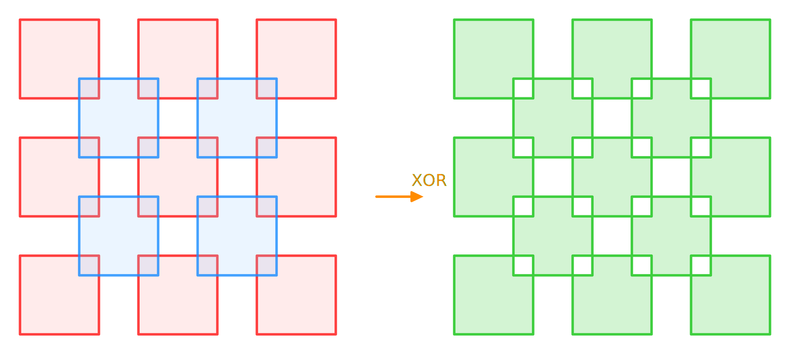
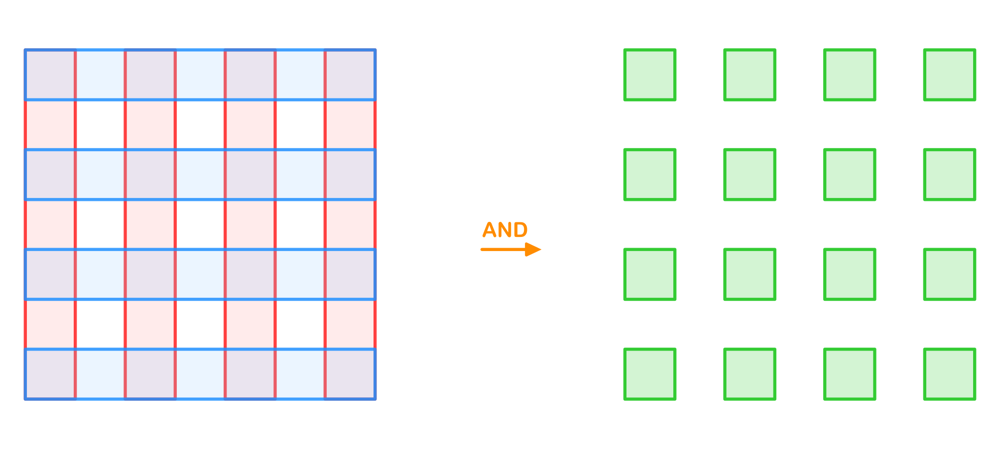
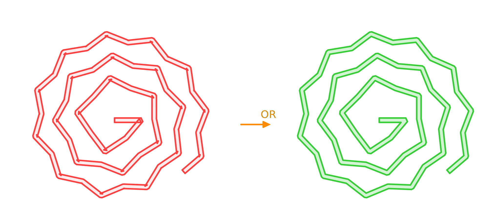
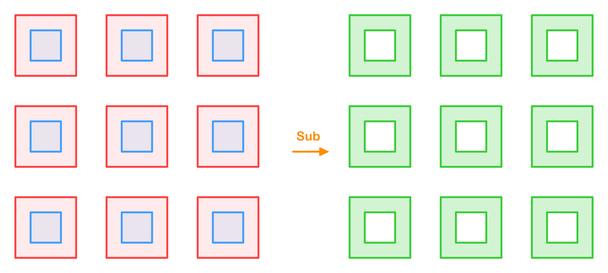
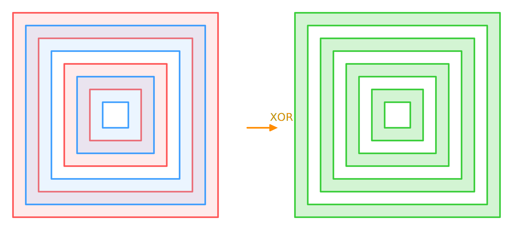

# Performance Comparison

Benchmark project is [here](https://github.com/iShape-Rust/iOverlayPerformance).

All tests were run on a machine with the following specifications:  
**3 GHz 6-Core Intel Core i5, 40GB 2667 MHz DDR4**  

All results are presented in seconds.

## Solvers:

- **iOverlay(Rust)** v1.6.4 (multithreading on/off)
- **iOverlay(Swift)**  v1.13.0
- **Clipper2(C++)**  v1.4.0

## Checkerboard Test

| Squares | Swift        | Rust (mt off) | Rust (mt on) | Clipper2      |
|---------|--------------|---------------|--------------|---------------|
| 5       | 0.000014     | 0.000006      | 0.000006     | 0.000007      |
| 25      | 0.000100     | 0.000034      | 0.000035     | 0.000038      |
| 113     | 0.000589     | 0.000187      | 0.000188     | 0.000208      |
| 481     | 0.004105     | 0.001061      | 0.001058     | 0.001017      |
| 1985    | 0.012643     | 0.004916      | 0.004932     | 0.005182      |
| 8065    | 0.055664     | 0.022938      | 0.023572     | 0.024013      |
| 32513   | 0.234840     | 0.106485      | 0.102122     | 0.154054      |
| 130561  | 0.993920     | 0.485524      | 0.451143     | 1.067439      |
| 523265  | 4.410302     | 2.225076      | 2.018615     | 8.346041      |
| 2095105 | 18.451646    | 9.763142      | 8.584972     | 73.312335     |
| 8384513 | 78.719305    | 39.584444     | 35.232285    | 644.337867    |

## Not Overlap Test

| Squares | Swift        | Rust (mt off)      | Rust (mt on) | Clipper2      |
|---------|--------------|--------------------|--------------|---------------|
| 5       | 0.000009     | 0.000003           | 0.000003     | 0.000005      |
| 25      | 0.000041     | 0.000012           | 0.000011     | 0.000021      |
| 113     | 0.000204     | 0.000057           | 0.000056     | 0.000097      |
| 481     | 0.001052     | 0.000313           | 0.000315     | 0.000457      |
| 1985    | 0.004978     | 0.001581           | 0.001569     | 0.002114      |
| 8065    | 0.021336     | 0.008185           | 0.008170     | 0.010783      |
| 32513   | 0.089523     | 0.039063           | 0.038043     | 0.056281      |
| 130561  | 0.375594     | 0.166031           | 0.162694     | 0.369146      |
| 523265  | 1.663087     | 0.776720           | 0.734016     | 2.695334      |
| 2095105 | 6.947932     | 3.237469           | 3.138123     | 20.665812     |
| 8384513 | 28.777569    | 14.386099          | 13.290805    | 167.966801    |

## Lines Net Test

| Squares | Swift        | Rust (mt off)      | Rust (mt on)   | Clipper2   |
|---------|--------------|--------------------|----------------|------------|
| 4       | 0.000014     | 0.000006           | 0.000006       | 0.000004   |
| 8       | 0.000049     | 0.000017           | 0.000017       | 0.000012   |
| 16      | 0.000195     | 0.000063           | 0.000063       | 0.000043   |
| 32      | 0.001295     | 0.000250           | 0.000257       | 0.000176   |
| 64      | 0.004994     | 0.001263           | 0.001268       | 0.000749   |
| 128     | 0.021239     | 0.005184           | 0.005768       | 0.003441   |
| 256     | 0.091427     | 0.026061           | 0.027286       | 0.018417   |
| 512     | 0.255989     | 0.133244           | 0.123429       | 0.115229   |
| 1024    | 1.146842     | 0.587539           | 0.524896       | 0.759640   |
| 2048    | 4.808548     | 2.347003           | 2.325153       | 5.595165   |
| 4096    | 20.190101    | 10.460054          | 9.386460       | 45.934461  |

## Spiral Test

| Squares | Swift      | Rust (mt off)   | Rust (mt on)  | Clipper2    |
|---------|------------|-----------------|---------------|-------------|
| 2       | 0.000006   | 0.000002        | 0.000003      | 0.000002    |
| 4       | 0.000010   | 0.000005        | 0.000005      | 0.000004    |
| 8       | 0.000019   | 0.000009        | 0.000009      | 0.000007    |
| 16      | 0.000040   | 0.000018        | 0.000018      | 0.000014    |
| 32      | 0.000095   | 0.000045        | 0.000045      | 0.000031    |
| 64      | 0.000218   | 0.000124        | 0.000127      | 0.000083    |
| 128     | 0.000490   | 0.000289        | 0.000286      | 0.000202    |
| 256     | 0.001105   | 0.000670        | 0.000720      | 0.000476    |
| 512     | 0.003385   | 0.001659        | 0.001583      | 0.001195    |
| 1024    | 0.006174   | 0.003518        | 0.003588      | 0.002941    |
| 2048    | 0.013200   | 0.008056        | 0.007770      | 0.007578    |
| 4096    | 0.026065   | 0.015971        | 0.015644      | 0.020287    |
| 8192    | 0.055944   | 0.033272        | 0.032830      | 0.054647    |
| 16384   | 0.112375   | 0.064134        | 0.063838      | 0.181050    |
| 32768   | 0.237412   | 0.137379        | 0.139423      | 0.606854    |
| 65536   | 0.473847   | 0.276421        | 0.272777      | 2.013809    |
| 131072  | 0.981729   | 0.588327        | 0.573041      | 6.547658    |
| 262144  | 1.979541   | 1.184652        | 1.184501      | 21.171540   |
| 524288  | 4.101912   | 2.492921        | 2.468238      | 72.147615   |
| 1048576 | 8.254108   | 4.973198        | 5.003705      | 259.866180  |

## Windows Test

| Squares | Swift      | Rust (mt off) | Rust (mt on)  | Clipper2    |
|---------|------------|---------------|---------------|-------------|
| 8       | 0.000016   | 0.000005      | 0.000005      | 0.000008    |
| 32      | 0.000062   | 0.000018      | 0.000018      | 0.000028    |
| 128     | 0.000276   | 0.000084      | 0.000084      | 0.000112    |
| 512     | 0.001306   | 0.000456      | 0.000454      | 0.000507    |
| 2048    | 0.005543   | 0.002036      | 0.002018      | 0.002454    |
| 8192    | 0.023805   | 0.009476      | 0.009374      | 0.012364    |
| 32768   | 0.104822   | 0.046010      | 0.046781      | 0.076850    |
| 131072  | 0.445712   | 0.202866      | 0.202866      | 0.568316    |
| 524288  | 1.862371   | 0.882740      | 0.873599      | 4.142673    |
| 2097152 | 7.657815   | 3.663786      | 3.558283      | 33.165570   |
| 8388608 | 30.833973  | 15.126074     | 14.128829     | 265.387333  |

## Nested Squares Test

| Squares | Swift      | Rust (mt off) | Rust (mt on) | Clipper2    |
|---------|------------|---------------|--------------|-------------|
| 4       | 0.000022   | 0.000010      | 0.000009     | 0.000012    |
| 8       | 0.000045   | 0.000018      | 0.000018     | 0.000023    |
| 16      | 0.000098   | 0.000037      | 0.000037     | 0.000050    |
| 32      | 0.000238   | 0.000082      | 0.000083     | 0.000118    |
| 64      | 0.000624   | 0.000210      | 0.000212     | 0.000291    |
| 128     | 0.001853   | 0.000594      | 0.000586     | 0.000806    |
| 256     | 0.002398   | 0.001850      | 0.001884     | 0.003415    |
| 512     | 0.005013   | 0.003224      | 0.002964     | 0.015989    |
| 1024    | 0.011067   | 0.005197      | 0.004924     | 0.081267    |
| 2048    | 0.023194   | 0.010648      | 0.010349     | 0.461883    |
| 4096    | 0.050601   | 0.025381      | 0.025834     | 2.347209    |
| 8192    | 0.111691   | 0.055089      | 0.052011     | 10.612424   |
| 16384   | 0.252357   | 0.137234      | 0.133035     | 46.205474   |
| 32768   | 0.581991   | 0.288295      | 0.272786     | 251.260857  |
| 65536   | 1.368794   | 0.773196      | 0.746876     | 3502.233611 |
| 131072  | 3.250746   | 1.684242      | 1.561850     | ----        |
| 262144  | 8.529555   | 4.827151      | 4.624782     | ----        |
| 524288  | 21.177892  | 10.261233     | 10.055448    | ----        |