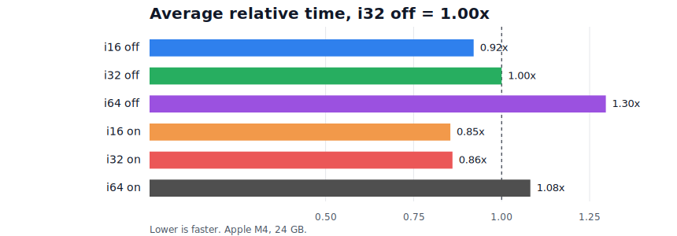
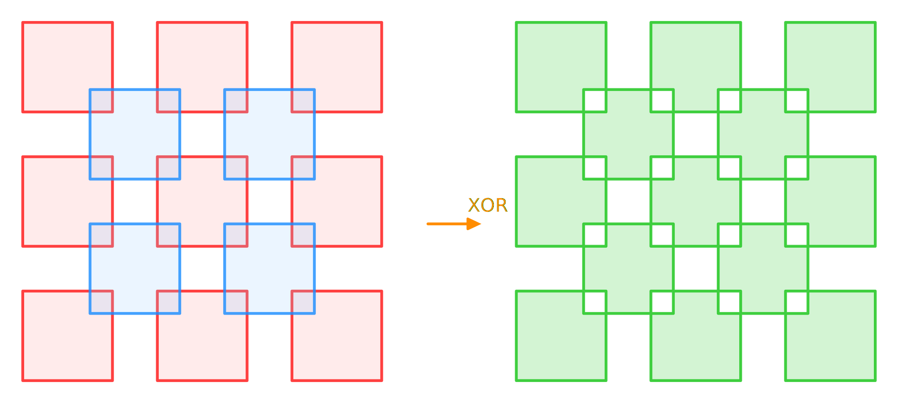
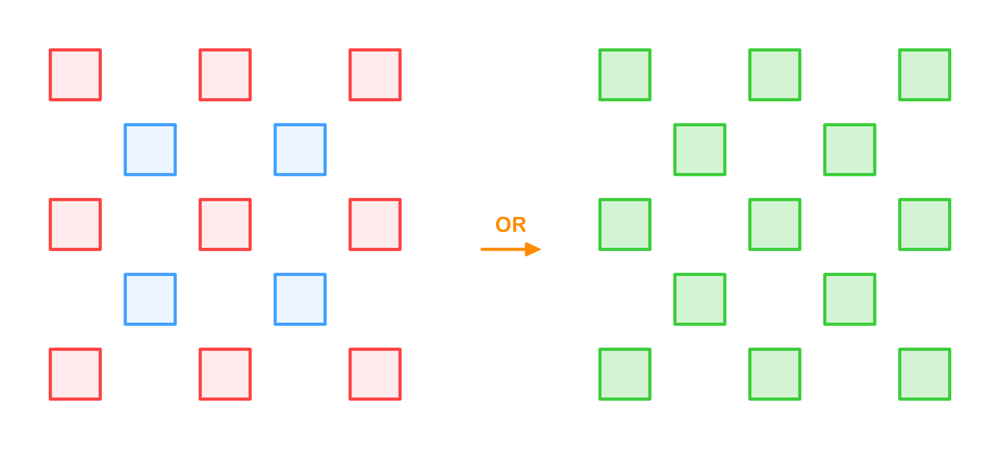
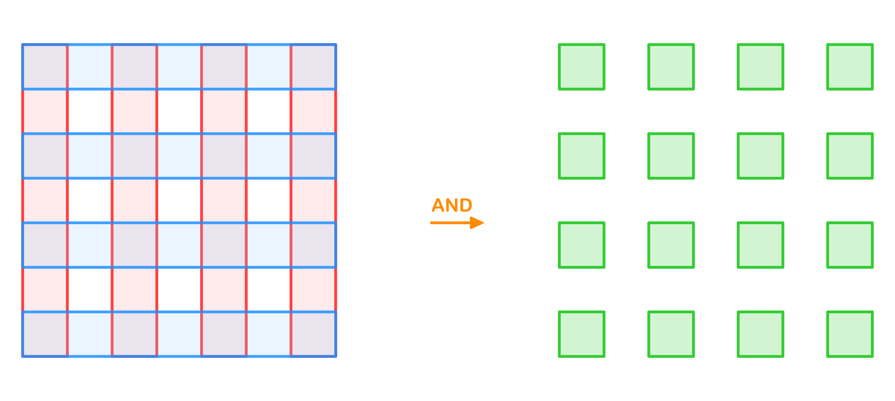
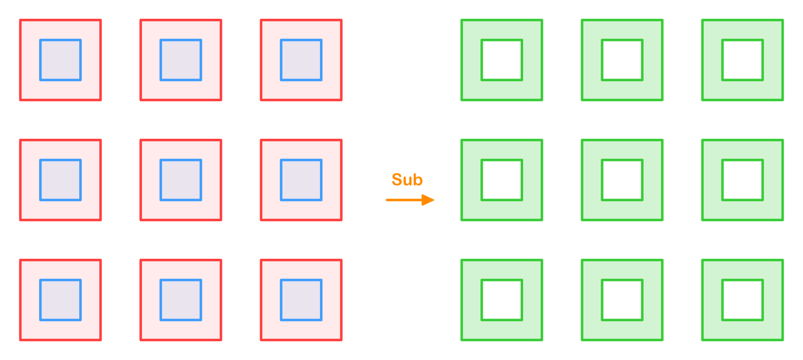
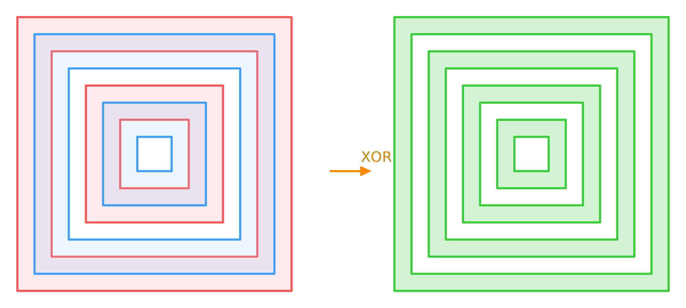

# Rust iOverlay Solver Benchmarks

All results were measured on **Apple M4, 24 GB**. Values are seconds per operation. The benchmark project is in [`performance/rust_app`](https://github.com/iShape-Rust/iOverlay/tree/main/performance/rust_app) in the [iOverlay repository](https://github.com/iShape-Rust/iOverlay).

- `i16/i32/64` math solvers
- `on/off` multithreading feature

## Average Comparison

## Checkerboard Test

| N | i16 off | i32 off | i64 off | i16 on | i32 on | i64 on |
|---:|---:|---:|---:|---:|---:|---:|
| 2 | 0.000002 | 0.000002 | 0.000003 | 0.000003 | 0.000002 | 0.000003 |
| 4 | 0.000015 | 0.000015 | 0.000017 | 0.000015 | 0.000015 | 0.000017 |
| 8 | 0.000082 | 0.000082 | 0.000099 | 0.000083 | 0.000081 | 0.000099 |
| 16 | 0.000426 | 0.000412 | 0.000498 | 0.000437 | 0.000409 | 0.000501 |
| 32 | 0.002236 | 0.002318 | 0.002733 | 0.002305 | 0.002299 | 0.002752 |
| 64 | 0.008070 | 0.008659 | 0.010388 | 0.007140 | 0.007243 | 0.008616 |
| 128 | 0.037559 | 0.040512 | 0.050085 | 0.027857 | 0.028986 | 0.035981 |
| 256 | 0.167375 | 0.178425 | 0.219622 | 0.120606 | 0.125711 | 0.158665 |
| 512 | 0.776731 | 0.827264 | 1.011703 | 0.568957 | 0.592768 | 0.724087 |
| 1024 | 3.385874 | 3.611125 | 4.393880 | 2.413621 | 2.610431 | 3.127404 |

## Not Overlap Test

| N | i16 off | i32 off | i64 off | i16 on | i32 on | i64 on |
|---:|---:|---:|---:|---:|---:|---:|
| 5 | 0.000001 | 0.000001 | 0.000001 | 0.000001 | 0.000001 | 0.000001 |
| 25 | 0.000005 | 0.000005 | 0.000006 | 0.000005 | 0.000005 | 0.000006 |
| 113 | 0.000024 | 0.000024 | 0.000027 | 0.000024 | 0.000024 | 0.000028 |
| 481 | 0.000136 | 0.000133 | 0.000152 | 0.000138 | 0.000132 | 0.000151 |
| 1985 | 0.000901 | 0.000912 | 0.001046 | 0.000908 | 0.000908 | 0.001053 |
| 8065 | 0.002461 | 0.002725 | 0.003178 | 0.002176 | 0.002322 | 0.002579 |
| 32513 | 0.011272 | 0.012319 | 0.014719 | 0.008377 | 0.008956 | 0.010409 |
| 130561 | 0.048214 | 0.053420 | 0.065100 | 0.034438 | 0.036901 | 0.044266 |
| 523265 | 0.220364 | 0.240664 | 0.301577 | 0.158055 | 0.177118 | 0.217189 |
| 2095105 | 0.927191 | 1.037521 | 1.300260 | 0.687777 | 0.745187 | 0.920391 |
| 8384513 |  | 4.580672 | 5.667204 |  | 3.282416 | 3.948376 |

## Lines Net Test

| N | i16 off | i32 off | i64 off | i16 on | i32 on | i64 on |
|---:|---:|---:|---:|---:|---:|---:|
| 4 | 0.000002 | 0.000002 | 0.000002 | 0.000002 | 0.000002 | 0.000002 |
| 8 | 0.000006 | 0.000006 | 0.000007 | 0.000006 | 0.000006 | 0.000007 |
| 16 | 0.000020 | 0.000020 | 0.000025 | 0.000021 | 0.000020 | 0.000025 |
| 32 | 0.000091 | 0.000087 | 0.000113 | 0.000092 | 0.000087 | 0.000114 |
| 64 | 0.000392 | 0.000425 | 0.000486 | 0.000403 | 0.000423 | 0.000497 |
| 128 | 0.001717 | 0.001791 | 0.002161 | 0.001716 | 0.001829 | 0.002118 |
| 256 | 0.008280 | 0.008733 | 0.010305 | 0.007047 | 0.007510 | 0.008971 |
| 512 | 0.037633 | 0.039941 | 0.048515 | 0.030516 | 0.032208 | 0.041422 |
| 1024 | 0.168466 | 0.181488 | 0.219835 | 0.130099 | 0.145159 | 0.181670 |
| 2048 | 0.751282 | 0.806123 | 0.991209 | 0.569064 | 0.622211 | 0.780686 |
| 4096 |  | 3.557761 | 4.420209 |  | 2.687778 | 3.220613 |

## Spiral Test

| N | i16 off | i32 off | i64 off | i16 on | i32 on | i64 on |
|---:|---:|---:|---:|---:|---:|---:|
| 2 | 0.000001 | 0.000001 | 0.000001 | 0.000001 | 0.000001 | 0.000001 |
| 4 | 0.000002 | 0.000002 | 0.000003 | 0.000002 | 0.000002 | 0.000003 |
| 8 | 0.000005 | 0.000005 | 0.000007 | 0.000005 | 0.000005 | 0.000008 |
| 16 | 0.000007 | 0.000010 | 0.000016 | 0.000007 | 0.000010 | 0.000016 |
| 32 | 0.000015 | 0.000021 | 0.000034 | 0.000015 | 0.000020 | 0.000033 |
| 64 | 0.000031 | 0.000043 | 0.000071 | 0.000031 | 0.000042 | 0.000069 |
| 128 | 0.000086 | 0.000092 | 0.000159 | 0.000076 | 0.000104 | 0.000154 |
| 256 | 0.000251 | 0.000298 | 0.000376 | 0.000279 | 0.000245 | 0.000380 |
| 512 | 0.000698 | 0.000790 | 0.001018 | 0.000764 | 0.000748 | 0.001008 |
| 1024 | 0.001818 | 0.002041 | 0.002658 | 0.001962 | 0.001984 | 0.002594 |
| 2048 | 0.004124 | 0.004207 | 0.005736 | 0.003950 | 0.004483 | 0.005705 |
| 4096 | 0.005286 | 0.007974 | 0.009687 | 0.004374 | 0.006270 | 0.005941 |
| 8192 | 0.010566 | 0.012796 | 0.017713 | 0.008446 | 0.009434 | 0.010722 |
| 16384 | 0.022061 | 0.028001 | 0.037901 | 0.017347 | 0.019526 | 0.023228 |
| 32768 | 0.045513 | 0.050997 | 0.075060 | 0.033183 | 0.034397 | 0.042546 |
| 65536 | 0.094961 | 0.113348 | 0.165686 | 0.065167 | 0.074229 | 0.091817 |
| 131072 | 0.201415 | 0.223653 | 0.336338 | 0.131789 | 0.146095 | 0.192015 |
| 262144 | 0.431597 | 0.541526 | 0.780771 | 0.301777 | 0.350941 | 0.449105 |
| 524288 | 0.666660 | 1.034178 | 1.536626 | 0.456391 | 0.744520 | 0.922172 |

## Windows Test

| N | i16 off | i32 off | i64 off | i16 on | i32 on | i64 on |
|---:|---:|---:|---:|---:|---:|---:|
| 8 | 0.000003 | 0.000003 | 0.000003 | 0.000003 | 0.000002 | 0.000003 |
| 32 | 0.000009 | 0.000008 | 0.000010 | 0.000009 | 0.000009 | 0.000010 |
| 128 | 0.000038 | 0.000038 | 0.000043 | 0.000038 | 0.000038 | 0.000043 |
| 512 | 0.000205 | 0.000195 | 0.000225 | 0.000204 | 0.000194 | 0.000224 |
| 2048 | 0.001127 | 0.001133 | 0.001338 | 0.001129 | 0.001138 | 0.001340 |
| 8192 | 0.003188 | 0.003421 | 0.004013 | 0.002633 | 0.002809 | 0.003138 |
| 32768 | 0.013917 | 0.015584 | 0.018626 | 0.010163 | 0.010892 | 0.012617 |
| 131072 | 0.063098 | 0.069925 | 0.088967 | 0.045737 | 0.049875 | 0.061721 |
| 524288 | 0.277322 | 0.312258 | 0.384434 | 0.199035 | 0.224817 | 0.267889 |
| 2097152 | 1.211561 | 1.382459 | 1.709374 | 0.909131 | 1.007965 | 1.175990 |

## Nested Squares Test

| N | i16 off | i32 off | i64 off | i16 on | i32 on | i64 on |
|---:|---:|---:|---:|---:|---:|---:|
| 4 | 0.000004 | 0.000004 | 0.000005 | 0.000004 | 0.000004 | 0.000004 |
| 8 | 0.000007 | 0.000007 | 0.000008 | 0.000007 | 0.000008 | 0.000009 |
| 16 | 0.000015 | 0.000015 | 0.000018 | 0.000015 | 0.000015 | 0.000018 |
| 32 | 0.000034 | 0.000033 | 0.000040 | 0.000034 | 0.000033 | 0.000040 |
| 64 | 0.000082 | 0.000079 | 0.000096 | 0.000083 | 0.000080 | 0.000097 |
| 128 | 0.000224 | 0.000213 | 0.000250 | 0.000228 | 0.000214 | 0.000253 |
| 256 | 0.000651 | 0.000659 | 0.000760 | 0.000698 | 0.000672 | 0.000756 |
| 512 | 0.002065 | 0.002060 | 0.002837 | 0.002015 | 0.002109 | 0.002833 |
| 1024 | 0.005356 | 0.005223 | 0.007613 | 0.005271 | 0.005426 | 0.007585 |
| 2048 | 0.009238 | 0.011609 | 0.015553 | 0.007070 | 0.007757 | 0.009880 |
| 4096 | 0.019098 | 0.023309 | 0.031292 | 0.019593 | 0.014683 | 0.018457 |
| 8192 |  | 0.081856 | 0.113196 |  | 0.046014 | 0.059750 |
| 16384 |  | 0.181416 | 0.245353 |  | 0.087646 | 0.122264 |
| 32768 |  | 0.667394 | 0.961019 |  | 0.322707 | 0.431346 |
| 65536 |  | 1.401006 | 2.059438 |  | 0.653741 | 0.933473 |
| 131072 |  | 5.445065 | 8.138039 |  | 2.410910 | 3.822923 |

