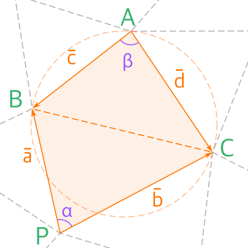

## Delaunay

Click on the canvas to drag the points

<canvas id="delaunayCanvas" width="500" height="500"></canvas>

### What is the Delaunay Condition?

When creating a triangulation network, the Delaunay condition aims to form triangles such that their circumscribed circles do not contain any other points from the dataset. In simpler terms, it ensures that triangles are "well-shaped" rather than "skinny," making the network more balanced and useful for various applications.

 

 

If the condition \\(\alpha + \beta < \pi\\) holds, it implies that the point \\(P\\) will lie outside the circumscribed circle. This confirms that a pair of triangles satisfies the Delaunay condition.

$$
\alpha + \beta < \pi \Rightarrow \sin(\alpha + \beta) > 0
$$

$$
\sin(\alpha + \beta) = \sin(\alpha)\cos(\beta) + \cos(\alpha)\sin(\beta)
$$

Calculating \\(\cos(\alpha)\\) and \\(\sin(\alpha)\\): 

$$
\cos(\alpha) = \frac{\vec{a} \cdot \vec{b}}{|a||b|} = \frac{a_{x}b_{x} + a_{y}b_{y}}{|a||b|}
$$

$$
\sin(\alpha) = \sqrt{1- \cos^2(\alpha)} = ... = \frac{|a_{x}b_{y} - b_{x}a_{y}|}{|a||b|} = \frac{|\vec{a} \times \vec{b}|}{|a||b|}
$$

Calculating \\(\cos(\beta)\\) and \\(\sin(\beta)\\): 

$$
\cos(\beta) = \frac{\vec{c} \cdot \vec{d}}{|c||d|} = \frac{c_{x}d_{x} + c_{y}d_{y}}{|c||d|}
$$

$$
\sin(\beta) = \frac{|\vec{c} \times \vec{d}|}{|c||d|} = \frac{|c_{x}d_{y} - d_{x}c_{y}|}{|c||d|}
$$

Final Equation:

$$
\sin(\alpha + \beta) = \frac{|a_{x}b_{y} - b_{x}a_{y}|\cdot(c_{x}d_{x} + c_{y}d_{y}) + (a_{x}b_{x} + a_{y}b_{y})\cdot|c_{x}d_{y} - c_{x}d_{y}|}{|a||b||c||d|} > 0
$$

$$
|a_{x}b_{y} - b_{x}a_{y}|\cdot(c_{x}d_{x} + c_{y}d_{y}) + (a_{x}b_{x} + a_{y}b_{y})\cdot|c_{x}d_{y} - d_{x}c_{y}| > 0
$$

Or in vector form:

$$
|\vec{a} \times \vec{b}|(\vec{c} \cdot \vec{d}) + (\vec{a} \cdot \vec{b})|\vec{c} \times \vec{d}| > 0
$$
