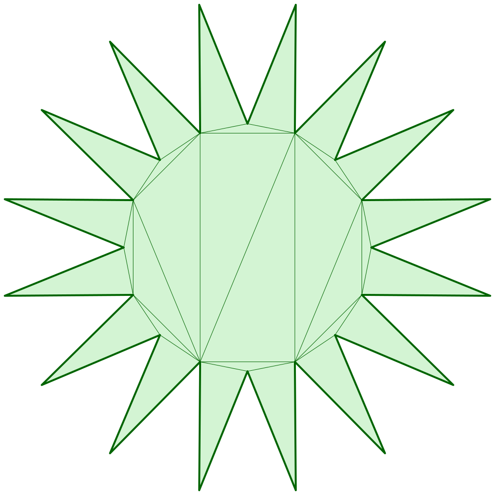
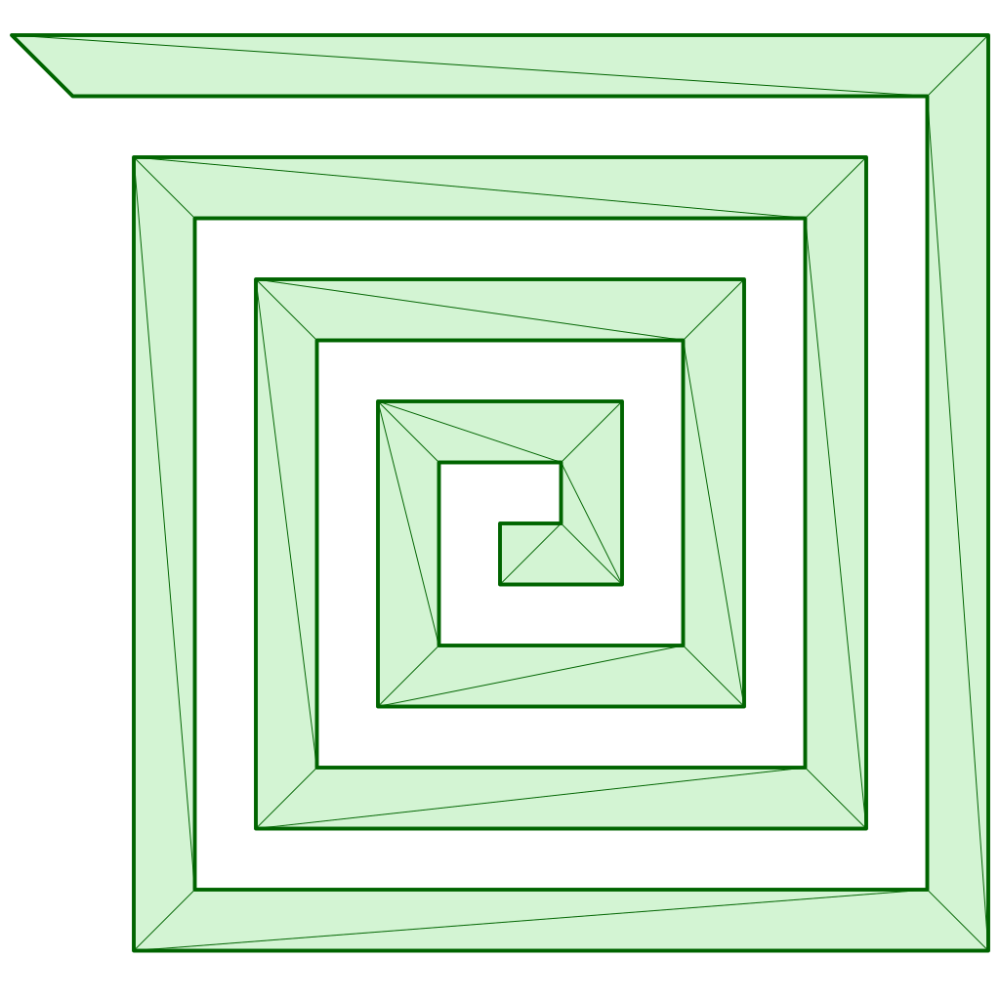
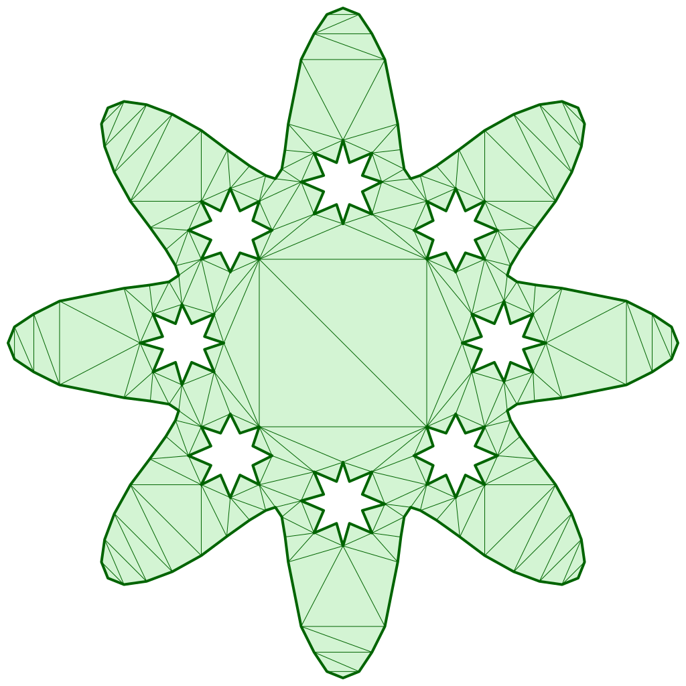

# Performance Comparison

Benchmark projects are:
- [rust](https://github.com/iShape-Rust/iTriangle/tree/main/performance)
- [cpp](https://github.com/iShape-Rust/cpp_triangle_performance_app)

All benchmarks were executed on the following machine:  
**3 GHz 6-Core Intel Core i5, 40GB 2667 MHz DDR4**

All results are presented in microseconds (10⁻⁶ sec).

Each test was repeated multiple times, and the average result is shown.

All input shapes are clean (non-self-intersecting), and the logic was optimized to achieve maximum performance.

## Solvers

- **iTriangle (Earcut64, Rust)** v0.36.1 — raw triangulation, no holes, limited to ≤64 points, validation disabled
- **iTriangle (Monotone, Rust)** v0.36.1 — raw triangulation, validation disabled
- **iTriangle (Delaunay, Rust)** v0.36.1 — Delaunay triangulation, validation disabled
- **MapBox (Earcut Rust)** v0.5.0 – Rust [port](https://crates.io/crates/earcutr) – raw triangulation, validation disabled
- **MapBox (Earcut C++)** v2.2.4 – C++ [official](https://github.com/mapbox/earcut.hpp) – raw triangulation, validation disabled
- **Triangle (Delaunay C)** v1.6 – C [official](https://www.cs.cmu.edu/~quake/triangle.html) - constrained Delaunay triangulation, validation disabled

## Star Test

  

### Raw

|Count |Earcut64      |Monotone      |Earcut Rust    |Earcut C++  |
|------|--------------|--------------|---------------|------------|
|8     |0.28          |0.5           |0.73           |0.42        |
|16    |0.6           |1.6           |1.23           |0.5         |
|32    |1.54          |3.9           |2.6            |1.2         |
|64    |4.46          |8.35          |5.6            |3.3         |
|128   |-             |17.8          |12.6           |8.4         |
|256   |-             |37.5          |29.1           |22.9        |
|512   |-             |79.7          |80.7           |72.7        |
|1024  |-             |172           |259            |209         |
|2048  |-             |388           |736            |641         |
|4096  |-             |898           |3158           |2804        |
|8192  |-             |1824          |13435          |11479       |
|16384 |-             |3846          |51688          |44017       |

### Delaunay

|Count |iTriangle     |Triangle      |
|------|--------------|--------------|
|8     |0.46          |4.3           |
|16    |1.0           |8.3           |
|32    |2.5           |25            |
|64    |6.65          |130           |
|128   |19.7          |271           |
|256   |40.5          |523           |
|512   |85.9          |1006          |
|1024  |194           |1704          |
|2048  |424           |2828          |
|4096  |987           |4806          |
|8192  |2074          |8581          |
|16384 |4533          |16384         |

## Spiral Test

  

### Raw

|Count |Earcut64      |Monotone      |Earcut Rust    |Earcut C++  |
|------|--------------|--------------|---------------|------------|
|8     |0.33          |0.7           |0.79           |0.42        |
|16    |1.13          |1.4           |1.71           |0.77        |
|32    |4.22          |3.0           |6.44           |3.4         |
|64    |19.1          |6.2           |18.6           |19.8        |
|128   |-             |12.8          |71.6           |66          |
|256   |-             |26.7          |295            |306         |
|512   |-             |55.5          |1230           |1438        |
|1024  |-             |120           |5301           |7595        |
|2048  |-             |279           |22682          |50140       |
|4096  |-             |685           |96933          |376060      |
|8192  |-             |1435          |416943         |3.7kk       |
|16384 |-             |3080          |1812147        |43.4kk      |

### Delaunay

|Count |iTriangle     |Triangle      |
|------|--------------|--------------|
|8     |0.51          |3.2           |
|16    |1.6           |8.7           |
|32    |5.0           |21.5          |
|64    |19.9          |35.6          |
|128   |14.6          |66.9          |
|256   |29.7          |166           |
|512   |62.2          |340           |
|1024  |139           |728           |
|2048  |313           |1469          |
|4096  |735           |82948         |
|8192  |1442          |6609          |
|16384 |3463          |13863         |

## Star with Hole Test

  

### Raw

|Count |Monotone      |Earcut Rust    |Earcut C++  |
|------|--------------|---------------|------------|
|128   |12.1          |31.9           |30.2        |
|256   |22.4          |86.6           |78.8        |
|512   |42.3          |227            |222         |
|1024  |84.4          |650            |593         |
|2048  |174           |2053           |1825        |
|4096  |333           |7102           |5702        |
|8192  |755           |26197          |22390       |
|16384 |1636          |102874         |80154       |

### Delaunay

|Count |iTriangle     |Triangle      |
|------|--------------|--------------|
|128   |16.8          |201           |
|256   |32.8          |410           |
|512   |61.6          |808           |
|1024  |121           |1616          |
|2048  |250           |3055          |
|4096  |505           |6410          |
|8192  |1401          |12919         |
|16384 |4093          |30704         |

## Star with 8 holes Test

  

### Raw

|Count |Monotone      |Earcut Rust    |Earcut C++  |
|------|--------------|---------------|------------|
|256   |19.3          |117            |43          |
|512   |30.3          |260            |107         |
|1024  |53.7          |437            |270         |
|2048  |107           |5018           |576         |
|4096  |200           |40596          |1517        |
|8192  |388           |156287         |3802        |
|16384 |797           |273567         |12687       |

### Delaunay

|Count |iTriangle     |Triangle      |
|------|--------------|--------------|
|256   |23.7          |330           |
|512   |41.6          |546           |
|1024  |71.4          |951           |
|2048  |143           |1777          |
|4096  |276           |3398          |
|8192  |567           |6921          |
|16384 |1539          |13748         |

