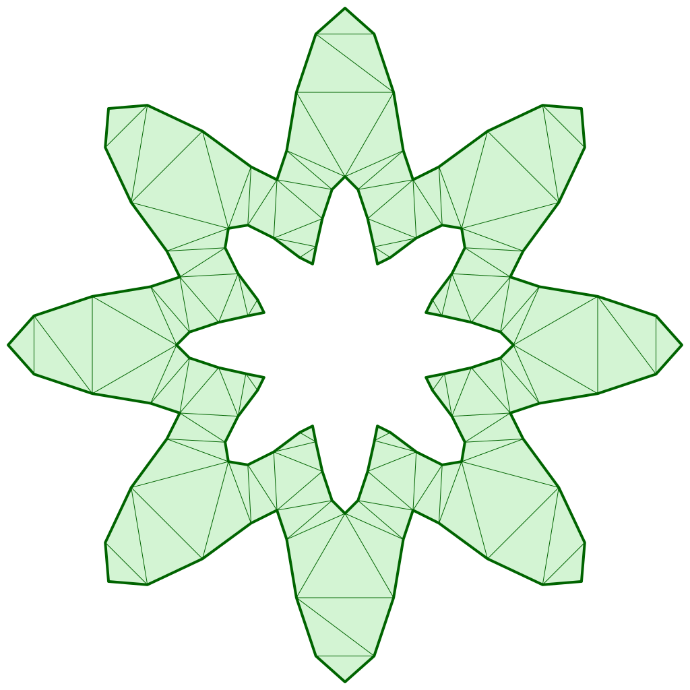

# Performance Comparison

Benchmark project is [here](https://github.com/iShape-Rust/iTriangle/tree/main/performance).

All tests were run on a machine with the following specifications:  
**3 GHz 6-Core Intel Core i5, 40GB 2667 MHz DDR4**  

All results are presented in seconds.

## Solvers:

- **iTriangle(Unchecked-Raw)** v0.31.0
- **iTriangle(Raw)** v0.31.0
- **iTriangle(Delaunay)** v0.31.0

## Simple Star Test

This test generates and triangulate 10,000 unique star-shaped polygons, one at a time.
Each shape is defined by:

- A unique radius scale (100 variations)
- A unique rotation (100 steps across a full circle)
- A given number of corners (count), each with 10 points

_All shapes are clean (non-intersecting), and no mesh is reused — each one is processed independently._

  

| Count   | Unchecked    | Raw           | Delaunay
|---------|--------------|---------------|--------------|
| 4       | 0.047844     | 0.074298      | 0.139643     |
| 8       | 0.098785     | 0.165002      | 0.284868     |
| 16      | 0.210214     | 0.369625      | 0.591876     |
| 32      | 0.455352     | 0.875200      | 1.256099     |
| 64      | 0.987139     | 2.241044      | 2.873866     |
| 128     | 2.107867     | 5.867757      | 7.073528     |
| 256     | 4.481360     | 16.652639     | 18.894593    |
| 512     | 9.372721     | 46.585559     | 50.478053    |

## Star with Hole Test

This test generates and triangulates 10,000 unique star-shaped polygons with a central hole, one at a time.
Each shape is defined by:

- A unique radius scale (100 variations)
- A unique rotation (100 steps across a full circle)
- A central hole generated as a smaller star
- A given number of corners (count), each with 10 points

_All shapes are clean (non-intersecting), and no mesh is reused — each one is processed independently._

  

| Count   | Unchecked    | Raw           | Delaunay
|---------|--------------|---------------|--------------|
| 4       | 0.110370     | 0.268433      | 0.369640     |
| 8       | 0.229584     | 0.593994      | 0.781789     |
| 16      | 0.480577     | 1.344304      | 1.689566     |
| 32      | 1.031568     | 3.294683      | 3.976463     |
| 64      | 2.223870     | 8.547062      | 9.689934     |
| 128     | 4.708570     | 24.225092     | 26.156747    |
| 256     | 9.891213     | 64.140800     | 71.023947    |

## Rect with Star Holes Test

This test generates and triangulates 25 unique rectangles filled with many 5 corners star-shaped holes.

Each shape is defined by:

- A large outer rectangle
- A grid of count × count small stars as holes, each with:
- A varying radius scale (5 variations)
- A unique rotation (5 variations)
- 5 corners per star, with 10 points per corner.

_All shapes are clean (non-intersecting), and no mesh is reused — each one is processed independently._

  

| Count   | Unchecked    | Raw           | Delaunay
|---------|--------------|---------------|--------------|
| 4       | 0.003435     | 0.009029      | 0.037794     |
| 8       | 0.013662     | 0.035041      | 0.112566     |
| 16      | 0.062749     | 0.152936      | 0.313631     |
| 32      | 0.268670     | 0.534618      | 0.927747     |
| 64      | 1.343702     | 2.542741      | 4.774121     |
| 128     | 5.680361     | 10.131110     | 23.526240    |
| 256     | 25.201445    | 45.647115     | 196.863314   |

